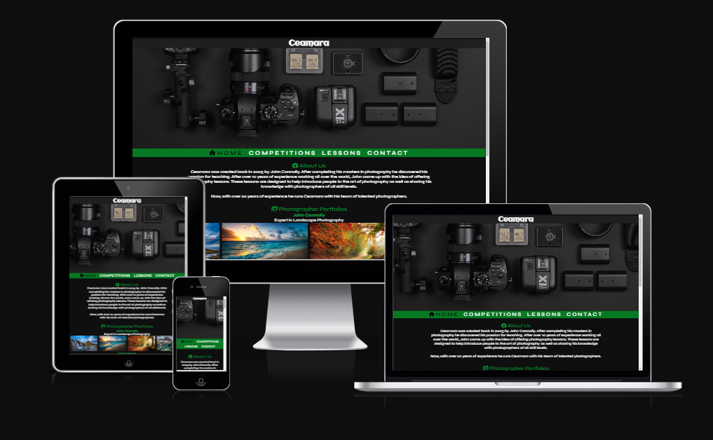
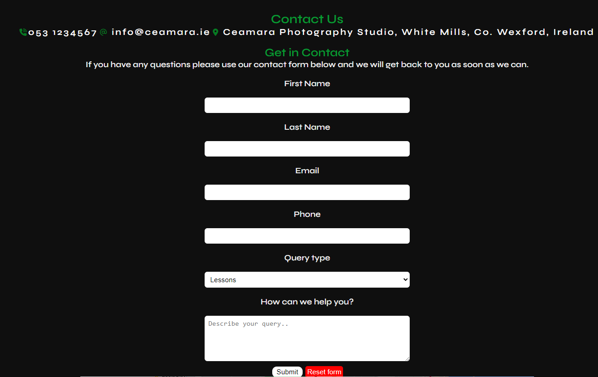

<h1>Ceamara</h1>
Ceamara is a site that provides information on photography lessons. They are based in Wexford, Ireland and target photographers of all skill levels. This site will allow photographers to contact Ceamara if they are interested in lessons or to enter into their competition.

<h2>Target Audience</h2>

People who love photography and want to learn more from an experienced photographer.

<h2>Wireframes</h2>
<h3>Home Page</h3>

<h3>Lessons Page</h3>

<h3>Competitions Page</h3>

<h3>Contact Page</h3>

<h2>User Goals</h2>
<ul>
<li>To learn more about lessons offered.</li>
<li>To learn lesson pricing and structure.</li>
<li>To enquire about or sign up for photography lessons.</li>
<li>To enter into the photography competition.</li>
</ul>

<h2>Features</h2>
<h3>Existing Features</h3>
<h4>Navigation</h4>

The navigation bar contains links to the home, lessons, competitions and contact page. The navigation will be the same on all pages so that the site is easy to navigate.

<h4>About Us</h4>

The about us section on the home page gives a brief description of the company and when it was created.

<h4>Portfolio</h4>

This section shows a small gallery of images taken by the different photographers in order to showcase their talents.

<h4>Competitions</h4>

This page allows users to enter into the photography competition hosted by Ceamara.

<h4>Lessons</h4>

This section gives details on the lessons offered by Ceamara. It provides information on who the lessons are aimed towards, lesson pricing and class sizes.

<h4>Contact Us</h4>

This page allows the user to enter in their details and query. It also has contact details such as phone, email and location. The form allows users to specify their query into options such as lessons, competitions, renting equipment and other.

There is also a google maps section which shows the user where Ceamara is located.

<h4>Footer

The footer contains the businesses social media links and it is the same on every page.

<h2>Testing</h2>
<h3>Validator Testing</h3>
<h4>HTML</h4>

index.html - No errors were found after passing code through W3C Validator.

lessons.html - - No errors were found after passing code through W3C Validator.

competitions.html - - No errors were found after passing code through W3C Validator.

contact.html - - No errors were found after passing code through W3C Validator.

<h4>CSS</h4>

No errors were found after passing code through W3C Validator.

<h3>Lighthouse Testing</h3>
</image>

After testing the website I received a warning that the image files were too big so I compressed them which improved the performance rating.

<h2>Unfixed Bugs</h2>

Unfixed bugs

<h2>Deployment</h2>

I deployed this site to GitHub pages. The steps to deploy are:

<ul>
<li>In the GitHub repository, navigate to the Settings tab</li>
<li>From the source section drop-down menu, select the Master Branch</li>
<li>Once the master branch has been selected, the page will be automatically refreshed with a detailed ribbon display to indicate the successful deployment.</li> </ul>

The live link can be found here:

<h2>Credits</h2>
<h3>Media</h3>
<ul>
<h4>Images</h4>
<ul>
<li>https://pixabay.com/photos/camera-lens-photography-flat-4830248/</li>
<li>https://pixabay.com/photos/beach-sun-evening-summer-sea-2836300/</li>
<li>https://pixabay.com/photos/photographer-photo-city-street-1805317/</li>
<li>https://pixabay.com/photos/road-forest-fall-autumn-season-1072823/</li>
<li>https://pixabay.com/photos/beach-sun-evening-summer-sea-2836300/</li>
<li>https://pixabay.com/photos/banana-trees-cabin-clouds-daylight-1850882/</li>
<li>https://pixabay.com/photos/iceland-mountains-kirkjufell-1768744/</li>
<li>https://pixabay.com/photos/woman-fashion-beauty-glamour-1274056/</li>
<li>https://pixabay.com/photos/asian-man-portrait-young-man-man-1468032/</li>
<li>https://pixabay.com/photos/cat-young-animal-kitten-gray-cat-2083492/</li>
<li>https://pixabay.com/photos/girl-beauty-fairytales-fantasy-2436545/</li>
<li>https://pixabay.com/photos/apples-red-bowl-still-life-fruits-2906457/</li>
<li>https://pixabay.com/photos/strawberry-fruit-bowl-food-berry-1330459/</li>
<li>https://pixabay.com/photos/adult-blur-bokeh-city-evening-1867665/</li>
<li>https://pixabay.com/photos/hong-kong-city-traffic-lights-1990268/</li>
<li>https://pixabay.com/photos/woman-portrait-model-fashion-hat-597173/</li>
<li>https://pixabay.com/photos/face-cute-happy-man-male-person-2171923/</li>
<li>https://pixabay.com/photos/man-smile-bold-elegant-male-1690965/</li>
<li>https://www.pexels.com/photo/professional-photographer-during-photo-shoot-in-studio-3800848/</li>
</ul
>
<h4>Icons</h4>
Sourced from: https://fontawesome.com/

<h4>Code</h4>
Image gallery tutorial from: https://www.w3schools.com/css/css_image_gallery.asp

<h4>Screen previews</h4>
Created using https://ui.dev/amiresponsive?

<h4>Wireframes</h4>
Created with https://balsamiq.com/wireframes/
</ul>
